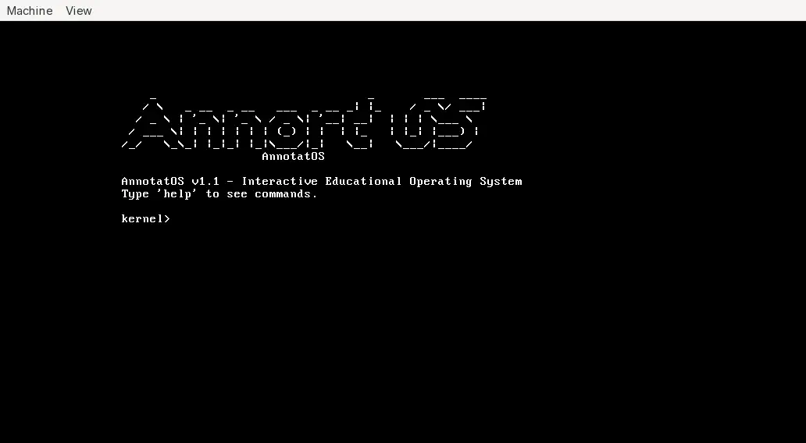

# AnnotatOS - Educational Operating System

<p align="center">
    
</p>

A minimal, functional operating system for learning OS development.

## Features

- Boots from disk (BIOS/MBR)
- Loads kernel safely with error handling
- Displays ASCII logo
- Interactive shell with keyboard input
- Clean, organized code structure
- Fully commented for learning
- Safe to experiment with

## Quick Start

```bash
# Build
make

# Run in QEMU
make run
```

## What You'll See

1. Bootloader messages
2. Kernel loading
3. ASCII AnnotatOS logo
4. Welcome message
5. Available commands
6. Interactive command prompt

## Project Structure

```
AnnotatOS/
├── boot/           # Bootloader
├── kernel/         # Kernel code
├── build/          # Build outputs
├── docs/           # Documentation
└── Makefile        # Build system
```

See `docs/STRUCTURE.md` for detailed structure explanation.

## Documentation

- `docs/STRUCTURE.md` - Project organization and build process
- `docs/SAFETY.md` - Safety information and troubleshooting
- `docs/README.md` - This file

## Requirements

- NASM (assembler)
- GCC (C compiler)
- Make
- QEMU (for testing)

### Install on Arch Linux
```bash
sudo pacman -S nasm gcc make qemu-system-x86
```

### Install on Ubuntu/Debian
```bash
sudo apt install nasm gcc make qemu-system-x86
```

## Building

```bash
make          # Build OS image
make run      # Build and run in QEMU
make clean    # Remove build files
make help     # Show all targets
```

## Learning Path

1. **Understand the structure**
   - Read `docs/STRUCTURE.md`
   - See how files are organized
   - Understand the build flow

2. **Read the bootloader**
   - Open `boot/boot.asm`
   - Read every comment
   - Understand boot process

3. **Read the kernel**
   - Open `kernel/kernel_entry.asm`
   - Open `kernel/kernel.c`
   - See how assembly calls C

4. **Make small changes**
   - Modify the ASCII logo
   - Change welcome message
   - Add print statements

5. **Rebuild and test**
   - Run `make clean && make run`
   - See your changes

## Safety

This OS is completely safe:
- Only runs in QEMU virtual machine
- Cannot damage your computer
- Proper error handling prevents boot loops
- Read `docs/SAFETY.md` for details

## Current Limitations

This is a minimal educational kernel:
- No Protected Mode (16-bit only for simplicity)
- No interrupts/drivers (keyboard uses polling)
- Shell supports basic built-in commands only

These are intentional to keep code simple and educational.

## Next Steps

After understanding this minimal version:
1. Add command history
2. Add Protected Mode
3. Add interrupt handling
4. Add more drivers

## Troubleshooting

### Build fails
```bash
make clean
make
```

### QEMU shows error
- Check error message
- Bootloader likely couldn't load kernel
- Rebuild: `make clean && make`

### Black screen
- Check `build/boot.bin` is 512 bytes
- Check `build/os.img` exists

See `docs/SAFETY.md` for more troubleshooting.

## Code Organization

### boot/boot.asm
- First 512 bytes loaded by BIOS
- Loads kernel from disk
- Error handling
- Jumps to kernel

### kernel/kernel_entry.asm
- Kernel entry point
- Sets up environment
- Calls C code

### kernel/kernel.c
- Main kernel logic
- Screen output
- ASCII logo
- Interactive shell

### Makefile
- Builds everything
- Creates bootable image
- Runs in QEMU

## How It Works

1. BIOS loads `boot/boot.asm` to memory 0x7C00
2. Bootloader loads `kernel/*.{asm,c}` from disk
3. Bootloader jumps to kernel
4. Kernel displays logo and messages
5. System accepts interactive shell commands
6. User can clear screen or exit QEMU

## Contributing

This is an educational project. Feel free to:
- Experiment with the code
- Add features
- Improve documentation
- Share your modifications

## Resources

- OSDev Wiki: https://wiki.osdev.org/
- Intel Manuals: https://www.intel.com/sdm
- NASM Docs: https://www.nasm.us/docs.php

## License

Educational use. Learn from it, modify it, share it.

## Author's Note

This OS is designed for learning. Every line is commented.
Every decision is explained. Start simple, build up gradually.

The goal is understanding, not features.

Have fun learning OS development!
